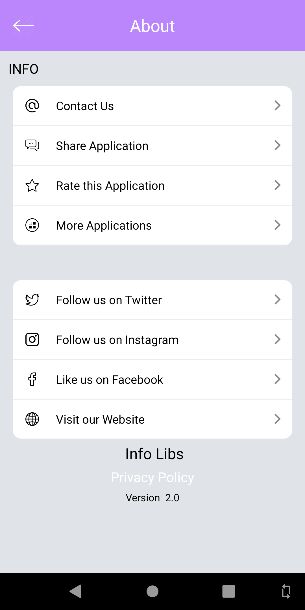

# AndroidInfoLibs

AndroidInfoLib is a library that helps developers add a **"Info Screen"** to their apps.

## Installation

How to

To get a Git project into your build:

Step 1. Add the JitPack repository to your build file


Add it in your root build.gradle at the end of repositories:

	allprojects {
		repositories {
			...
			maven { url 'https://jitpack.io' }
		}
	}

Step 2. Add the dependency

	dependencies {
	        implementation 'com.github.AppAspectTech:AndroidInfoLibs:1.2'
	}

## How to use
To use this library just add this snippet in the `onClick` of your Info icon.

Example:

```java
 try {

        String str_tag = "Info_Fragment";
        String str_addToBackStack = "Info_Fragment";;
        Bundle bundle_info=new Bundle();
        bundle_info.putString(INL_Constant_Data. Publisher_Name, INL_Constant_Data.AppAspect); // publisher name (AppAspect or GuruInfoMedia)
        bundle_info.putInt(INL_Constant_Data.InfoScreen_BG_Color,getResources().getColor(R.color.grey_bg));//Info screen Background color
        bundle_info.putInt(INL_Constant_Data.Header_BG_Color,getResources().getColor(R.color.white)); // Header layout background color
        bundle_info.putInt(INL_Constant_Data.Header_Text_Color,getResources().getColor(R.color.white)); // set Header Text Color
        bundle_info.putInt(INL_Constant_Data.Privacy_Policy_Text_Color,getResources().getColor(R.color.white)); // set privacy policy Text Color
        bundle_info.putString(INL_Constant_Data.Theme,INL_Constant_Data.Theme_Dark); // Info screen theme (White or dark)
        bundle_info.putString(INL_Constant_Data.Privacy_URL,""); // Privacy url
        bundle_info.putString(INL_Constant_Data.Terms_And_Condition_URL,""); // Terms and Condition url
        bundle_info.putString(INL_Constant_Data.App_Name,""); // Application Name
        bundle_info.putString(INL_Constant_Data.App_Package_Name,getPackageName()); // Application Package name
        bundle_info.putString(INL_Constant_Data.App_Version_Name,""); // Application Version name

        bundle_info.putString(INL_Constant_Data.Device_Model,""); // Device Model Name
        bundle_info.putString(INL_Constant_Data.Device_OS,""); // Device OS version

        bundle_info.putBoolean(INL_Constant_Data.Header_Show_Hide,false); // if fragment pass true otherwise false
        Info_Fragment info_fragment=new Info_Fragment();
        info_fragment.setArguments(bundle_info); // passing all application information in bundle
        FragmentManager fragmentManager = getSupportFragmentManager();
        FragmentTransaction fragmentTransaction = fragmentManager.beginTransaction();
        //fragmentTransaction.replace(R.id.container, info_fragment, str_tag).addToBackStack(str_addToBackStack).commit();

        bundle_info.putBoolean(INL_Constant_Data.Header_Show_Hide,true); // if fragment pass true otherwise false
        Intent intent = new Intent(MainActivity.this, Info_Activity.class);
        intent.putExtras(bundle_info);
        startActivity(intent);

        } catch (Exception e)
        {

        }
```
## Preview Info Screen


## Used by

If you use my library, please tell me at info@appaspect.com
So I can add your app here!


## License
Do what you want with this library.